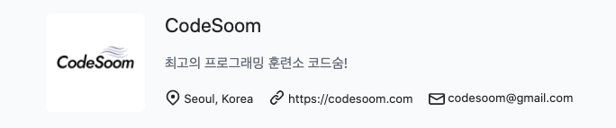

최근에 딱딱하고 어려운 개발책 말고 조금은 가볍지만 저에게 좋은 인사이트를 줄 책을 찾아보다가, "함께 자라기"라는 재미있는 책을 발견하게 되었습니다. 이 책은 결국 우리가 무언가 멋진 일을 해내기 위해서는 누군가와 "함께" 학습을 하며 "자라야" 한다는 애자일의 중요한 핵심 메세지를 던져주는 책이었어요. 이 책의 머릿말은 이런 질문으로 시작합니다.

***"내가 정말 잘할 수 있을까? 아니, 우리가 정말 자랄수 있을까?"***

저도 같은 질문으로 2020년 회고를 시작해볼까 합니다. 이 책의 머릿말과 같이 저의 2020년은 "내가 정말 개발자로 성장할 수 있는지"에 대한 의문으로 시작되었고, 이 의문에 대한 답을 찾아왔던 시간들이었거든요. 비록 1년이 지난 지금도 여전히 헤매고 부족한 것이 많지만, 2020년 한 해 동안 질문에 대한 답을 찾고 개발자로 성장한 과정을 돌아보며 글을 써볼까 합니다.

 

### 어쩌다보니 개발자가 되어버렸다

*"난아, 이제는 우리 회사에서 개발자로 일할래?"*

올해 3월, 여느 때와 다르지 않은 업무 전화였지만 그 날 대표님은 저에게 이렇게 물어보셨어요. 그 때 저는 작년 미국 실리콘밸리 프로그램에서 인연이 닿은 작은 헬스케어 스타트업에서 일을 하고 있었습니다. 실리콘밸리 프로그램을 할 당시에는 작은 앱 기획을 맡은 인턴이었지만, 제가 시작한 이 프로젝트를 조금이라도 더 해보고 싶다는 마음에 한국으로 돌아오기 며칠 전 당차게(?) 대표님을 찾아가 "이 회사에서 더 일하게 해주세요!"라고 이야기를 했고, 좋다는 답을 받아내며(!) 한국에 돌아와서도 이 회사와 계속 일을 하게 된 것이었어요. 

당차게 하고 싶다고는 이야기했지만 디자이너도 개발자도 없는 회사에서 혼자 모바일 앱 프로젝트를 진행하는 것은 사실 대책없이 시작한 일이긴 했습니다. 그렇지만, 완벽할 수는 없어도 ***'엉망진창이어도 해보는 것'*** 만큼은 제가 할 수 있는 일이라는 생각이 들었고, 저는 그 날부터 제가 하나씩 할 수 있는 일들을 해나가기 시작했습니다. 앱 기획을 하고 나자 앱의 디자인이 필요했고, 저는 어도비 일러스트레이터와 XD를 배워서 앱의 디자인을 하게 되었습니다. 디자인을 하고 나자 구동되는 앱이 필요했고, 저는 학교 다닐 때 수업에서 배운 `flutter`로 앱을 개발하기 시작했습니다. 그런 저의 모습을 좋게 본 대표님이 개발자로 다시 미국에 와서 일을 하자고 제안을 해주신거였어요.

 

그리고 올해 4월, 이 회사에서 "개발자"라는 새로운 이름으로 일을 하며 감사하게도 프로젝트의 작은 결실을 보게 되었습니다. 앱을 iOS와 안드로이드 버전을 모두 런칭했으며, 회사의 새로운 사업이 되면서 새로운 디자이너와 함께 일도 하게 되고 앱 마케팅을 하게 되었으니까요. 이 회사에서의 경험은 개발자로 내딛는 첫 걸음이 된 소중한 경험이 되었습니다. 

하지만 솔직하게 말하자면, 동시에 저에게 큰 절망감을 안겨주는 경험이기도 했습니다. 인터넷에서 복사해온 저의 코드는 정말 엉망진창이었고, 저의 코드이지만 설명하지 못하는 것이 대부분이었으며, 심지어 에러도 많은 앱이었거든요. 이 회사에서 저는 개발자라고 불리고 있었지만 제가 개발자로서 너무 부끄러운 실력이라는 것을 아주 잘 알고 있었거든요. 개발자로서 **완벽하게 혼자** 일하며 어디에 도움을 구할 수도 없는 답답한 상황들이 이어지며, 저는 저의 성장을 도와주고 **함께 나아갈 누군가**를 간절하게 바라게 되었습니다.

 

### 코드숨과 함께 개발자로 성장하다

 

누군가에 대한 필요는 자연스럽게 **저를 성장시켜줄 사람들이 있는 좋은 기회**를 찾아나서게 했습니다. 저는 그렇게 코드숨의 리액트 1기 프로그램을 신청하게 되었고, 2020년 6월부터 8월까지 총 3개월간 프로그램을 들으며 저의 간절했던 필요를 채우며 개발자로 한걸음 성장을 하게 되었어요. 코드숨을 하며 저는 javascript의 기초부터 공부하는 것을 시작으로, 리액트를 배우고 TDD를 적용하기 시작했으며 혼자서 웹을 개발하고 배포까지 하는 경험을 하게 되었습니다. 

그리고 시간이 지나 먼발치에서 코드숨을 했던 지난 3개월을 돌아보니, 저는 코드숨을 통해 지식보다 더 중요한 것을 배운 것을 깨닫게 되었습니다. 코드숨을 하며 배운것을 돌아보고자 TIL을 작성하던 습관이 이제는 회사에 다녀와서 꾸준히 **회고를 하는 습관**으로 바뀌게 되었습니다. 또 꾸준한 학습을 해야만 좋은 개발자가 될 수 있다는 것을 배운 후, 이제는 코드숨 스터디를 하며 함께 꾸준히 책을읽고 **공부**하게 되었습니다. 그리고 무엇보다도 코드숨을 통해 **함께 배우고 성장할 사람**들을 얻게 되었습니다.

이러한 가치들이 우리가 짜는 몇 줄의 코드처럼 눈에 보이는 것들은 아니지만, 이제는 개발자로 하루하루 살고 있는 저의 익숙한 일상의 시작을 거슬러 올라가보면 코드숨과 함께 했던 3개월이 있었던 거 같습니다. 3개월간 지켜온 저의 꾸준함과 이러한 저를 응원하고 도와주는 감사한 사람들 덕분에, 저는 이제 스스로 부끄럽지 않은 개발자로 성장을 하게 되었던 거 같아요. 

> 코드숨 홈페이지: https://www.codesoom.com/  
> 코드숨 회고: https://naraekn.github.io/codesoom-retrospective/

 

### 37,661명이 사용한 서비스를 개발하다

 

또 올해 최고의 경험 중에 하나는, 몇 만 명이 사용한 `hello, silicon valley`라는 실리콘밸리 기업 추천 심리테스트를 개발한 경험이었습니다. 처음부터 이렇게 많은 사용자들이 사용할거라고 예상하고 시작하지는 않았습니다. 그저 코드숨에서 개인 프로젝트를 진행해야 했는데, 이왕이면 저의 경험과 이야기를 녹이면서도 사람들이 많이 유입될만한 서비스가 무엇일까 생각하다가 떠올린 아이디어였거든요. 

총 4주간 열심히 개발한 프로젝트 링크를 제출하고, 저는 이제 "이제 코드숨 끝이다!"라고 외치며 두 발 뻗고 누워서 천천히 구글 애널리틱스도 붙이고 홍보도 해볼 계획을 세우고 있었어요. 그런데 그날 저녁, `hello, silicon valley` 웹사이트 링크를 아샬님이 페이스북에 올리셨고, 이 것이 시작이 되어 아샬님을 follow 하던 사람들이 테스트를 하며 순식간에 빠른 속도로 사람들의 입소문을 타게 되었어요. 그 다음날 오전 부랴부랴 구글 애널리틱스를 달았는데, 몇 시간만에 4000명이 들어왔다는 놀라운(!) 숫자가 찍혀있었고 일주일만에 20000명이 넘는 사람들이 사용하는 웹사이트가 되었습니다.

 

이렇게 제가 만든 웹사이트가 유행을 하면서 트위터에서는 실제로 실리콘밸리에서 구글이나 페이스북을 다니시는 분이 테스트를 해보고 결과를 공유했고, 저희의 이야기는 스타트업 여성의 일과삶 뉴스레터에 실리기도 했으며, 다양한 회사로부터 외주와 협업을 제안 받기도 했습니다. 그리고 이제 `hello silicon valley`는 `2020/08/24 ~ 2020/12/31` 기준으로 총 **46개국의 37,661명**의 사람들이 사용했으며. **총 페이지뷰수 58,679뷰**를 달성한 웹사이트가 되었습니다. 이 웹사이트를 개발을 한 경험을 통해 제가 만든 소프트웨어가 수많은 사람들이 사용하고 좋아해줄 때 얼마나 짜릿하고 즐거운 것인지를 알게되었고, 이제는 더 많은 사람들과 함께 더 큰 서비스를 개발해보고 싶다는 마음을 심어주는 소중한 계기가 되었습니다.

> 헬로실리콘밸리: https://hellosiliconvalley.me/  
> 프로젝트 깃헙: https://github.com/naraekn/hello-silicon-valley

 

### flutter 오픈소스에 기여하다 

 

올 해 또 코드숨 외에 했던 것은, 오픈소스 컨트리뷰톤에 참여해서 flutter 오픈 소스에 기여한 일이었습니다. 처음에는 거대한 오픈소스 생태계에 제가 할 수 있는 것이 있을까 의문이었지만, flutter moum 팀의 멘토분들께 오픈소스에 기여하는 법을 배우며 제가 기여할수 있는 것들을 작은 것부터 찾아나서게 되었어요. 초보자가 하기에 가장 쉬운 기여 중 하나는, flutter 공식 문서에 빠져있는 샘플코드들을 채워넣는 PR들을 날렸고, 저의 PR은 구글 엔지니어 분께 LGTM을 받고 Merge 되어(LGTM: Looks Good To Me!의 줄임말로 코드리뷰를 승인할때 쓰는 표현) 저의 코드는 flutter 공식 도큐먼트에 올라가게 되었습니다. 

 

아주 작은 기여였지만 수많은 개발자가 사용하는 flutter 오픈소스에 직접 기여를 한 것은 꽤 뿌듯한 경험이되었으며, 저보다 더 열심히한 팀원들 덕분에 오픈소스 컨트리뷰톤에서 **대상이라는 (무려 대한민국 장관상이라구요!)** 좋은 결과도 얻게 되었습니다.

> 샘플코드1 PR: https://github.com/flutter/flutter/pull/65274  
> 샘플코드2 PR: https://github.com/flutter/flutter/pull/63833  
> 샘플코드2가 반영된 flutter 공식문서: https://api.flutter.dev/flutter/widgets/SizeTransition-class.html

 

### 마켓 컬리의 웹 개발자가 되다

 

그리고 마지막으로 올해 10월 말, 저는 이제 대한민국에서 백 만명이 넘는 사람들이 사용한다는 신선식품 배송 서비스 **마켓컬리의 웹 개발자**가 되었습니다. 이제 돌아보니 회사에 들어온지 두 달이 좀 넘는 시간이 지났네요. 짧다면 짧을 수도 있는 시간이지만, 작은 배움과 성장 한 가지 정도는 이뤄내는데는 충분한 시간이었던 거 같습니다. 그래서 어느 하루는 회사에서 돌아와 "나는 이제까지 컬리에서 무엇을 배웠는가?"에 대해서 스스로 질문하고 회고를 작성한적이 있습니다. 그 날 저는 회고를 이렇게 시작했던 거 같아요.

*"나는 컬리에서 '함께 하는 법'을 배우고 있는 거 같다."*

올해 초의 저는 혼자서 일하는 것이 일상이었지만, 이제는 컬리에서 동료들과 함께 일을 하는 법을 배워나가고 있습니다. 사실 처음 입사를 했을 때는 누구보다도 함께 일하는 것이 서투른 개발자였던 거 같아요. 저의 부족한 모습을 보이기 싫어서 도움을 구하기보다 혼자서 끙끙대며 문제를 해결했고, 모르는 것이 있을 때 혼자서 질문을 해야할지 한참을 고민하다가 겨우 질문을 하기도 했습니다. 그렇지만 일련의 과정들을 거치며 이러한 저의 태도가 저의 성장에도 팀에도 도움이 되지 않는다는 것을 깨달았으며, 저의 옆에는 언제나 저를 도와줄 수 있는 동료들이 존재한다는 것을 알게 되었습니다. 이제는 기획자와 백엔드 개발자들과 일을 위해 소통하고, 기술 리더분과 점심챗을 하며 컬리의 성장에 대하여 이야기를 나누고, 팀원들과 함께 서로의 코드를 리뷰하고 모르는 것이 있다면 물어보고 서로 도움을 주고 받는 **매일의 평범한 일상**을 통해 **함께함의 가치**를 배우게 되었습니다. 물론 컬리도 부족하고 아쉬운 점들이 있지만 지금 이 시간만큼은 잠시 접어두려고 합니다. 누군가에게는 지루하고 당연한 일상일 수 있지만, 저에게는 수십명의 개발자들과 함께 거대한 서비스를 만들어 나가며 성장하는 지금 이 시간들이 감사한 일상들이니까요.

 

### 마무리

이제 다시 처음으로 돌아가 "함께 자라기"라는 책 이야기를 해보려고 합니다. 이 책의 마지막 표지에는 이런 질문이 쓰여있습니다.

***"우리가 정말 매일매일 함께 자랄 수 있을까?"***

그리고 2020년이 몇 시간 안 남은 끝자락에 서서, 저는 이 질문에 대하여 이렇게 대답하며 2020년 회고를 짧게 마무리 지을까합니다.

**"네 그럼요, 자랄수 있습니다. 매일 꾸준히 누군가와 함께 한다면요!"**